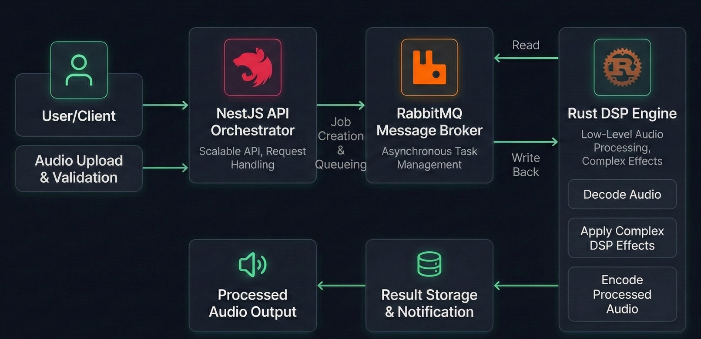

# Event-Driven Audio Processing Engine

A high-performance, distributed audio processing engine. This project leverages Rust for low-level Digital Signal Processing (DSP), NestJS as a scalable API orchestrator, and RabbitMQ to manage asynchronous processing tasks. Designed to apply complex audio effects with near-zero overhead.

## Architecture

The system is designed with a decoupled, event-driven architecture, making it scalable and resilient. It consists of three main components:

1. **API (NestJS):** A Node.js application built with the NestJS framework that provides a RESTful API for clients to upload audio files and request processing.
2. **Message Broker (RabbitMQ):** A RabbitMQ instance that acts as a message broker between the API and the Worker. It ensures reliable communication and queuing of processing tasks.
3. **Worker (Rust):** A high-performance Rust application that consumes tasks from the message queue. It performs the heavy lifting of audio processing using low-level DSP libraries.

### Pipeline

The following diagram illustrates the project's pipeline:



## Components

### Backend (API)

- **Framework:** NestJS
- **Language:** TypeScript
- **Purpose:** To provide a RESTful API for audio file uploads and to dispatch processing jobs to the worker via RabbitMQ.
- **Key Dependencies:**
  - `@nestjs/common`, `@nestjs/core`, `@nestjs/platform-express`: Core NestJS modules.
  - `amqplib` (or similar): For interacting with RabbitMQ (to be added).

### Worker (DSP Engine)

- **Language:** Rust
- **Purpose:** To perform computationally intensive audio processing tasks. It listens for jobs from RabbitMQ, processes the audio files, and stores the result.
- **Key Dependencies:**
  - `lapin`: For RabbitMQ communication.
  - `symphonia`: For decoding various audio formats.
  - `hound`: For writing WAV files.
  - `tokio`: For asynchronous runtime.
  - `serde`, `serde_json`: For data serialization/deserialization.

## Getting Started

To run the system, you will need Docker and Docker Compose installed.

1. **Clone the repository:**

   ```bash
   git clone <repository-url>
   cd event-driven-system
   ```

2. **Run the services:**

   ```bash
   docker-compose up -d --build
   ```

This will start the API, the Worker, and the RabbitMQ broker.

- The API will be available at `http://localhost:3000`.
- The RabbitMQ management UI will be available at `http://localhost:15672` (user: `guest`, pass: `guest`).

## Future Development

- Implement specific audio effects in the Rust worker (e.g., reverb, delay, equalization).
- Add database integration to store metadata about the audio files and processing jobs.
- Implement WebSocket support to provide real-time feedback to clients on the processing status.
- Enhance security with authentication and authorization for the API.
